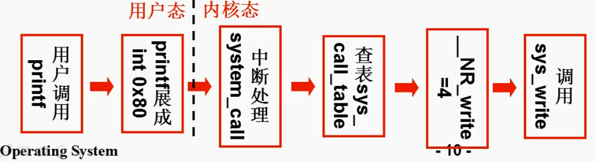

# 操作系统
## 操作系统的启动
*ref*: https://www.peterjxl.com/ComputerOS/boot/#head-s
### 打开电源后......
+ 以x86架构机器为例，一上电，CPU处于实模式
+ CS = 0xFFFF，IP = 0x0000，就是内存在0xFFFF0处ROM BIOS的指令
+ BIOS处的指令首先会检查外设，例如CPU，键盘，显示器，硬盘等
+ 然后会将磁盘0磁道0扇区的内容读到内存的0x7C00处
+ 最后设置CS = 0x7C00， IP = 0x0000，开始执行引导扇区里的代码
### 引导扇区代码: bootsect.s
第一件事：将代码挪到0x9000处执行
```
SETUPLEN = 4			! nr of setup-sectors
BOOTSEG  = 0x07c0		! original address of boot-sector
INITSEG  = 0x9000		! we move boot here - out of the way
SETUPSEG = 0x9020		! setup starts here
entry start
start:
	mov	ax,#BOOTSEG
	mov	ds,ax
	mov	ax,#INITSEG
	mov	es,ax
	mov	cx,#256
	sub	si,si
	sub	di,di
	rep	movw
	jmpi	go,INITSEG		!段间跳转 cs=INITSEG, ip=go
go:	mov	ax,cs
	mov	ds,ax
	mov	es,ax
```
1 ~ 4行可以理解为定义了一个变量，值是我们后续会用到的地址

第5行：关键字entry告诉链接器“程序入口” 从start 标号开始

第6行：CPU开始执行第5行的指令（上一句表明了程序的入口）

‍

接下来执行完这两句后，ds = 0x07c0 ：
```
mov	ax,#BOOTSEG
mov	ds,ax
```
‍

同理，执行完这两句后，es = 0x9000 ：
```
mov	ax,#INITSEG
mov	es,ax
```
‍
接下来做什么呢？就是将bootsect.s里的代码，全部挪到内存 0x9000处：使用的是rep指令，复制256个字，也就是512字节，刚好一个扇区，从0x7c00开始的一个扇区的代码。
```
mov	cx,#256
sub	si,si !源地址 ds:si = 0×07C0:0×0000
sub	di,di !目的地址 ds:si = 0×09000:0×0000
rep	movw  !重复移动字指令，至到cx=0
```
‍
接下来执行一个跳转指令：
```
jmpi	go,INITSEG !段间跳转 cs=INITSEG, ip=go
```
也就是将0x9000作为基址，go作为偏移地址。我们可以推理出来，既然bootsect.s已经挪到 0x9000处， 我们就应该跳转到 0x9000处，继续往下执行bootsect.s处的代码，且我们可以看到go标号就在 跳转指令的下一行，所以其实就是继续往下执行bootsect.s。

### 加载setup模块
```
go:	mov	ax,cs
	mov	ds,ax
	mov	es,ax
	mov	ss,ax
	mov	sp,#0xFF00		! arbitrary value >>512 
load_setup:
	mov	dx,#0x0000		! drive 0, head 0
	mov	cx,#0x0002		! sector 2, track 0
	mov	bx,#0x0200		! address = 512, in INITSEG
	mov	ax,#0x0200+SETUPLEN	! service 2, nr of sectors
	int	0x13			! read it
	jnc	ok_load_setup		! ok - continue
	mov	dx,#0x0000
	mov	ax,#0x0000		! reset the diskette
	int	0x13
	jmp	load_setup
```
当执行到go处的代码时，CS = 9000，而go标号处 到 load_sectup标号处的代码，将段寄存器DS，ES，SS的值都设置为了9000。因此目前所有段寄存器的值都是 0x9000

下一步，就是用0x13号中断 ，将setup模块从磁盘加载到内存里。因为我们一开始只将引导扇区读入进来了，而操作系统还有很多内容要读进来。

我们来解读下load_setup代码：

在执行13号中断之前，我们要先传参给中断例程，其中

+ ah 是功能号 02表示读磁盘。 00表示磁盘系统复位
+ al 是读取扇区的数量，因为ax = 0x0200 + SETUPLEN，因此al = 4，表示读取4个扇区
+ ch 是柱面号， 这里表示读取0柱面号，
+ cl 是要读取的扇区。这里是2，表明读2号扇区（这里需要说明一下，其实扇区是从1开始编号的，而第一个扇区是引导扇区，因此读下一个扇区就是2号扇区；而之前说的0磁道0扇区指的是 0号逻辑扇区，其对应的是1号物理扇区。如果不理解也没关系，记住是读下一个扇区即可）
+ dh  是磁头号， dl是驱动器号 这里都是0，表明还是读0磁道 0号驱动器
+ es ：bx 内存地址，用于存放磁盘里的内容
传递参数后，就执行13号中断，下一行代码是 jnc ok_load_setup​如果正常读入了，就跳转到 ok_load_setup处执行代码。而如果有异常，就将磁盘系统复位，继续尝试读取sectup扇区（无条件跳转 jmp load_setup​）。

### 显示开机画面并读取system模块
读入setup模块后，接下来做什么呢？setup模块只有4个扇区，操作系统当然不只这么少代码，因此读入了setup模块后，继续读入操作系统的system模块。我们来看看ok_load_setup的关键代码：
```
ok_load_setup:
	mov	ch,#0x00
	mov	sectors,cx
	mov	ax,#INITSEG
	mov	es,ax


	mov	ah,#0x03
	xor	bh,bh
	int	0x10	; ah 功能号为3，表示读取光标位置

	mov	cx,#24
	mov	bx,#0x0007
	mov	bp,#msg1
	mov	ax,#0x1301
	int	0x10	; ah功能为为13，作用是显示字符串，es：bp是串地址，cx是串长度

	mov	ax,#SYSSEG
	mov	es,ax		! segment of 0x010000
	call	read_it   ; 这里就是读入system模块
	jmpi	0,SETUPSEG  ; 跳转到0x09020:0000处执行代码，也就是执行setup.s


; ...........这里省略一些代码, 以下这段代码在bootsect.s的244行.......
msg1:
	.byte 13,10
	.ascii "Loading system ..."
	.byte 13,10,13,10
```
‍

我们来分析下上述代码做了什么：
+ 首先是用 int 0x10读取光标的位置，
+ 然后将字符串 "Loading system ..."显示到光标的位置上
+ 然后执行reat_it函数读入system模块，读到内存 0x10000处，这里我们就不继续展开了
+ 最后跳转到setup.s处执行

其实，第二步就是我们看到的开机画面了，只不过当时显示的比较简单和粗糙。因此，我们可以做实验一了，就是修改一下计算机的开机画面，例如改成 “Hello World!” 。这里也说一下大致的思路：首先修改下msg处的字符串，然后数一下要显示的字符个数，然后修改cx，重新汇编bootsect.s即可。

### setup.s模块
setup.s模块会将操作系统从0x10000开始的位置移动到0X0000处，并设置好GDT表，GDT表中规定了代码段和数据段的段基址（都设置为了0）、段限长、段读写权限、段访问特权级别等。
## 操作系统初始化程序（init）

### 系统调用的过程（以write为例）
在write.c中，由`_syscall3`这个宏展开定义`write`
```C
/*
 *  linux/lib/write.c
 *
 *  (C) 1991  Linus Torvalds
 */

#define __LIBRARY__
#include <unistd.h>

_syscall3(int,write,int,fd,const char *,buf,off_t,count)
```
而`_syscall3`执行过程如下:
```C
#define _syscall3(type,name,atype,a,btype,b,ctype,c) \
type name(atype a,btype b,ctype c) \
{ \
long __res; \
__asm__ volatile ("int $0x80" \  //执行0x80终端
	: "=a" (__res) \             
	: "0" (__NR_##name),"b" ((long)(a)),"c" ((long)(b)),"d" ((long)(c))); \
if (__res>=0) \
	return (type) __res; \
errno=-__res; \
return -1; \
}
```
“asm” 是内联汇编语句关键词，表明接下来是汇编语句了；“volatile” 表示编译器不要优化代码,后面的指令 保留原样；

+ 第4行是汇编语句，这里是中断；

+ 第5行 是 输出寄存器，这里是表示代码运行结束后将 eax 所代表的寄存器的值放入 `__res` 变量中；也就是返回值

+ 第6行是 输入寄存器，`__NR_##name`​​​其实是将函数参数里的name替换了这里的name，因此最后结果是`__NR_write`； 因此，操作系统就会知道是4号的系统调用号，知道要去执行`write`这个系统调用。

`"b"((long)(a))`​ 这里是把函数的参数a 置给EBX，

`"c"((long)(b))​` 第二个参数置给ECX，

`"d"((long)(c))`​ 第三个参数置给EDX

接下来几行就是判断中断执行有无异常，没有就返回 res，有的话就返回异常信息

`int 0x80`中断函数入口地址存放在`IDT（Interrupt Descriptor Table）`表中，由操作系统启动时初始化好的
```c
void sched_init(void)
{
	//…… 这里省略其他代码
	set_system_gate(0x80,&system_call);
}

#define set_system_gate(n,addr) \
	_set_gate(&idt[n],15,3,addr)   //这里IDT是中断向量表基址，addr就是system_call函数的地址

#define _set_gate(gate_addr,type,dpl,addr) \
__asm__ ("movw %%dx,%%ax\n\t" \
	"movw %0,%%dx\n\t" \
	"movl %%eax,%1\n\t" \
	"movl %%edx,%2" \
	: \
	: "i" ((short) (0x8000+(dpl<<13)+(type<<8))), \
	"o" (*((char *) (gate_addr))), \
	"o" (*(4+(char *) (gate_addr))), \
	"d" ((char *) (addr)),"a" (0x00080000))

```

一个系统调用的过程：printf ->_syscall3 ->write -> int 0x80 -> system_call -> sys_call_table -> sys_write 　　‍

​​
+ 用户调用printf的时候转化为`write`所需要的参数，此时CPL = 3，`wirte`由`_syscall3`宏展开进行定义，会展开成一段包含int 0x80的代码
+ 在系统初始化的时候，设置了IDT表，将int 0x80的中断处理函数设置成system_call，并且设置DPL也等于3，所以才可以执行 “跳转到system_call”这条指令。
+ 进入`system_call`函数后，CPL是变成0的 ，接下来就在内核里处理
`system_call`里 会根据系统调用号，查表`sys_call_table`这里printf的系统调用号是4因此最后会调用sys_write（这里就可以操作和访问内核的数据段)